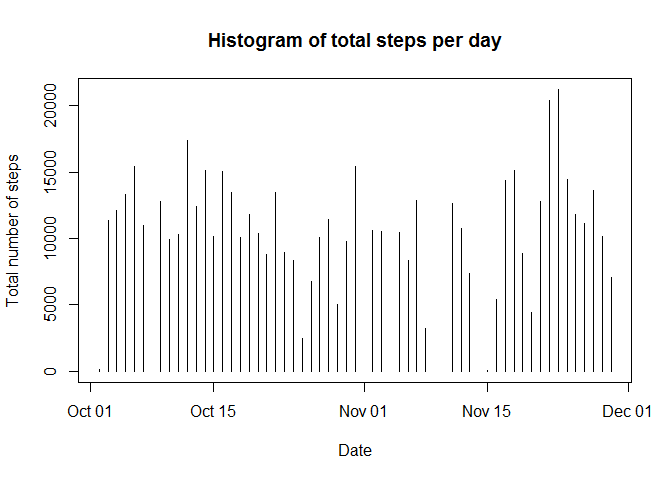
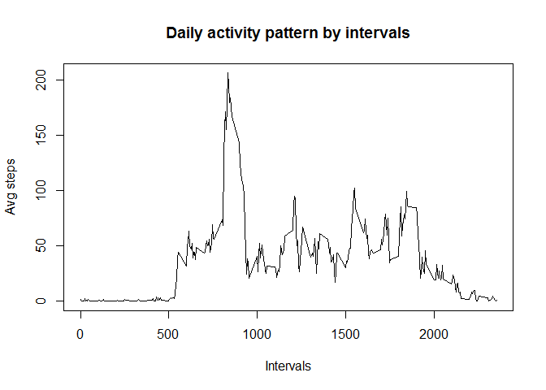
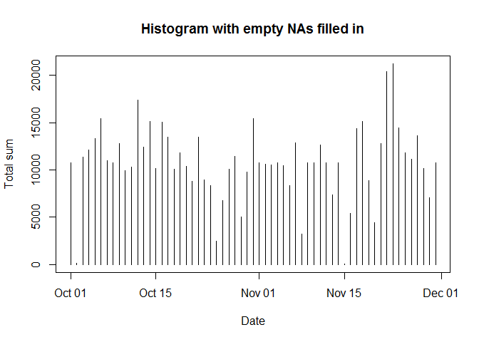

# Reproducible Research: Peer Assessment 1


```r
echo = TRUE  # Always make code visible
```

## Loading and preprocessing the data

```r
unzip("activity.zip")
data.raw <-read.csv("activity.csv",colClasses=c("integer","Date","integer"))
data.notNa <-na.omit(data.raw)
```


## What is mean total number of steps taken per day?

```r
# Use dataset where rows with NA are removed
daily<-aggregate(data.notNa$steps,list(data.notNa$date),sum)
colnames(daily)<-c("date","total.sum")
plot(daily$date,daily$total.sum,type="h",
     main="Histogram of total steps per day",
     xlab="Date",ylab="Total number of steps")
```

 

Mean number of total steps taken during entire timespan

```r
mean(daily$total.sum)
```

```
## [1] 10766.19
```

Median number of total steps taken during entire timespan

```r
median(daily$total.sum)
```

```
## [1] 10765
```

## What is the average daily activity pattern?

```r
intervaly<-aggregate(data.notNa$steps,list(data.notNa$interval),mean)
colnames(intervaly)<-c("interval","avg.steps")
plot(intervaly$interval,intervaly$avg.steps,type="l",
     main="Daily activity pattern by intervals",
     xlab="Intervals",ylab="Avg steps")
```

 

Interval with maximum daily activity

```r
intervaly[intervaly$avg.steps==max(intervaly$avg.steps),]$interval
```

```
## [1] 835
```


## Imputing missing values
Total number of missing values in the dataset (i.e. the total number of rows with NAs)

```r
nrow(data.raw[is.na(data.raw),])
```

```
## [1] 2304
```

We'd use the mean for that 5-minute interval to fill in the NAs.

```r
data.isNa<-data.raw[is.na(data.raw),]
#Merge the isNa dataset with the avg values of the 5 min interval
data.isNa.merged<-merge(data.isNa,intervaly,by="interval")
data.isNa.new<-data.isNa.merged[,c("avg.steps","date","interval")]
colnames(data.isNa.new)<-c("steps","date","interval")
#Append the new isNa dataset with the notNa dataset to create the new dataset
data.new <-rbind(data.notNa,data.isNa.new)
```

## Histogram/Mean/Median of the new dataset

```r
daily<-aggregate(data.new$steps,list(data.new$date),sum)
colnames(daily)<-c("date","total.sum")
plot(daily$date,daily$total.sum,type="h",
     main="Histogram with empty NAs filled in",
     xlab="Date",ylab="Total sum")
```

 

```r
mean(daily$total.sum)
```

```
## [1] 10766.19
```

```r
median(daily$total.sum)
```

```
## [1] 10766.19
```
Mean value remains the same understandably while the median has changed.

## Are there differences in activity patterns between weekdays and weekends?

```r
data.new$weekdays <- factor(weekdays(data.new$date))
levels(data.new$weekdays) <- list(weekday = c("Monday", "Tuesday",
                                             "Wednesday", 
                                             "Thursday", "Friday"),
                                 weekend = c("Saturday", "Sunday"))

intervaly<-aggregate(data.new$steps,list(data.new$interval,data.new$weekdays),mean)
colnames(intervaly)<-c("interval","weekdays","avg.steps")

library(lattice)
xyplot(intervaly$avg.steps ~ intervaly$interval | intervaly$weekdays, 
       layout = c(1, 2), type = "l", 
       xlab = "Interval", ylab = "Number of steps")
```

 

Yes, He tends to be more sedentary during the late morning and afternoon in the weekday. Some interpretation for this might be, he is holding office bound job.
